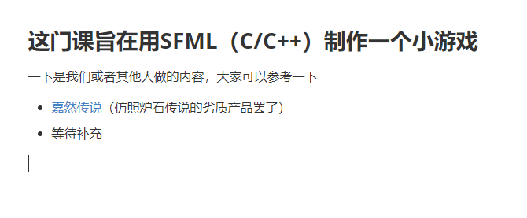

# HDU-Digital Media Technology
 杭州电子科技大学数字媒体技术指南

## 给共同开发者

- 你们可以按照格式新建文件，把自己的所思所想写在上面

- 你们可以自己创建一个github仓库，然后通过超链接的方式链接过去，比如一下格式

  

- 你们可以多写一点公选课
- 你们可以分享自己的网站或者其余内容，并把它放到合适的地方

## ”我“有建议

- 你可以发送邮件到542876162@qq.com

- 打开Issues，提交一个问题

## 写在前头

杭州电子科技大学（简称HDU，杭电）是一所双非大学，在浙江，大学共八斗，浙江大学独占七斗，因此“浙江第二名大学”有十几所。

杭电优势学课是计算机类，信息经管，因此各项资源多少会有一些倾斜，对于“数字媒体技术”这个专业，虽然身属“计算机”，但是被挂在“人文院”下，因此，理工科类的竞赛参加的人会稍稍较少。如果你是一名纯粹的理工生，请你认真研读你所在年级的==数字媒体技术专业培养计划==，这会告诉你未来会学些什么，然后转专业。

本专业是并不分流。比如艺术类是大类招生，在学习一段时间后会分成（数字媒体艺术：产品设计）；计算机类是大类招生，在学习一段时间后会分为（软件工程：计科），而**数字媒体技术**不会分流(已经是一个小专业了)。

## 有关于转专业

等待写入

# 真正有用的，细致到每一门学课

*前排提示：学科仅针对本人所学经历，若有改动，延缓谅解-*

⭐代表重要的程度

前排参考连接：

[杭电试卷库](https://github.com/FengGuanxi/HDU-Experience)

[legroft's blog](https://jinjis.cn)

## 公共选修课~这种课我就不单独新建一个文件了~

👌：推荐程度，5个位最高上限，有私货；

- 电池技术概论：一般，自习课，第二节课就可以走，85-90👌👌👌👌
- 影视音乐赏析：只点到三次，提前通知，群里发码，👌👌👌👌👌👌👌👌👌👌👌👌👌👌👌👌👌👌👌👌👌👌👌👌👌👌👌👌95
- 大众传播伦理学：蒋小花，老师人好，和蔼，记得偷偷去把课上回答问题全部打满！👌👌👌👌👌90-95
- 大学生与法：蒋小花，老师人好，和蔼，记得偷偷去把课上回答问题全部打满！👌👌👌👌👌90-95
- 心理实践与拓展（心理模块）：王亚楠×陈文干（但实际上是王亚楠一个人，千万不要选陈文干的可）去4次，最后一次考试，逃不掉的，无法评价
- [大学军事](公共选修/大学军事.md)（大学军事模块）：老师都大差不差，选就是了。
- 创业基础（创业模块）：大差不差，选就是了，注意:小组作业！严选划水!
- [跨文化交际](公共选修/跨文化交际.md)（英语拓展模块）:我选的老师不错，👌👌👌👌👌
- 法律心理学：姜丽娜，科普了很多有意思的内容，但是课堂是传授式的，互动率比较低，适合过去听，或者自习，点到率五六次👌👌👌👌👌，90-95
- 互联网法律：钱侃侃，点到率：节节必点，但是讲课有趣，都是从自己的亲生经历出发，十分有用，（我认为）公选课里排第一，从不照念ppt，我认为，值得！👌👌👌👌👌👌👌👌👌👌👌👌👌👌👌👌👌👌👌👌👌👌👌👌👌👌👌👌👌👌👌👌👌👌👌👌👌👌👌👌👌👌👌👌👌👌👌👌👌👌👌👌👌👌👌👌👌👌👌👌👌👌👌👌👌👌👌👌👌👌👌👌👌👌👌👌👌👌👌👌👌👌👌👌👌👌👌👌👌👌👌👌👌👌👌👌👌👌👌👌👌👌👌👌👌👌👌👌👌👌👌👌👌👌👌👌👌👌👌👌👌👌👌👌👌👌👌👌👌👌👌👌👌成绩看你自己。

## 大一上 

- 体育1（太极拳）
- 英语听说1A/B/C
- 英语精读1A/B/C
- [高等数学B1⭐](大一上/高等数学B.md)
- 线性代数⭐
- C语言程序设计⭐
- 大学生心理健康教育
- 思想道德修养与法律基础（也就是初中的思想品德课）
- 数字媒体技术概论
- 形势与政策1

## 大一下

- 体育2
- 英语精读2A/B/C
- 英语听说2A/B/C
- 高等数学B2⭐
- C++面向对象程序设计⭐
- 绘画基础（万恶的课程，手残绝对不想碰到，听说现在已经变成专业选修了？）
- 中国近代史纲要
- 平面制作课程设计
- 数字摄影
- [高级C编程](大一下/高级C编程.md)
- 绘画基础课程设计
- 形式与政策2
- ~~信息类学课导论课~~（现在已经被删除了）

## 大二上

- 体育3
- 图像处理与分析
- 计算机图形学原理⭐
- 数字媒体后期制作
- [交互动画基础](大二上/交互动画基础)
- 数据结构⭐
- 数据结构课程设计
- 毛泽东思想和中国特色社会主义理论体系概论1
- [网页前端技术](大二上/网页前端技术)
- 概率论与数理统计
- 形式与政策3
- 大学生职业发展与就业指导1
- 军训（没错我们军训在大二）
## 大二下

- 操作系统⭐
- [操作系统课程实践](大二下/操作系统课程设计/README.md)
- 界面设计
- 形式与政策4
- 认识实习
- 大学生职业发展与就业指导2
- [互联网技术（计算机网络）⭐](大二下/计算机网络)
- [毛泽东思想和中国特色社会主义理论体系概论2](大二下/毛概)
- [游戏程序设计](大二下/游戏程序设计/游戏程序设计.md)
- [游戏程序设计课程设计](大二下/游戏程序课程设计)
- 实践选修三选一
  - 游戏
  - 网站
  - 视频

## 大三上

