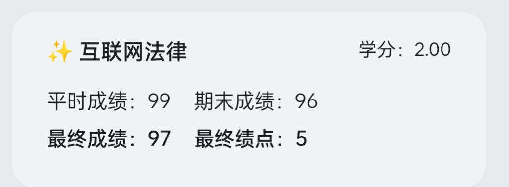
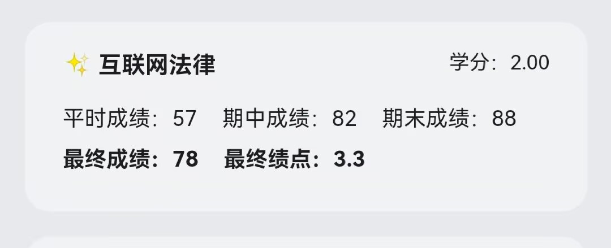
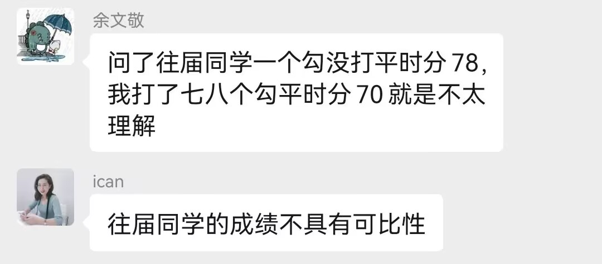
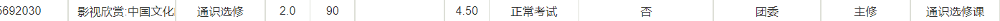

# HDU-Digital Media Technology
 杭州电子科技大学数字媒体技术指南

## 给共同开发者

- 你们可以按照格式新建文件，把自己的所思所想写在上面

- 你们可以自己创建一个github仓库，然后通过超链接的方式链接过去，比如一下格式

  

- 你们可以多写一点公选课
- 你们可以分享自己的网站或者其余内容，并把它放到合适的地方

## ”我“有建议

- 你可以发送邮件到542876162@qq.com

- 打开[Issues](https://github.com/liangzilixueha/HDU-Digital-Media-Technology/issues)，提交一个问题

## 写在前头

杭州电子科技大学（简称HDU、杭电）是一所双非大学，在浙江，大学共八斗，浙江大学独占七斗，因此“浙江第二名大学”有十几所。

杭电优势学课是计算机类，信息经管，因此各项资源多少会有一些倾斜，对于“数字媒体技术”这个专业，虽然身属“计算机”，但是被挂在“人文院”下，因此，理工科类的竞赛参加的人会稍稍较少。如果你是一名纯粹的理工生，请你认真研读你所在年级的==数字媒体技术专业培养计划==，这会告诉你未来会学些什么，然后转专业。

本专业是并不分流。比如艺术类是大类招生，在学习一段时间后会分成（数字媒体艺术/产品设计）；计算机类是大类招生，在学习一段时间后会分为（软件工程/计算机科学与技术），而**数字媒体技术**不会分流。
**数字媒体技术、软件工程、计算机科学与技术均为计算机大类下的二级学科。**

感到迷茫的了怎么办？看看这篇知乎[为什么在上海交大这种学校，也容易堕落得一塌糊涂？又该怎么自我拯救？](https://www.zhihu.com/question/303130196/answer/2711149884)

[杭州电子科技大学培养方案2018-2021夸克网盘](https://pan.quark.cn/s/fd1e95f6b096)

[杭州电子科技大学培养方案2018-2021百度网盘](https://pan.baidu.com/s/1V_drzVfU9_B4FnbLJqJBZA?pwd=ebiu)

[杭州电子科技大学培养方案2022百度网盘](https://pan.baidu.com/s/1OhlSpqqOnV1Yj2KaDzm_og?pwd=2022)

[杭州电子科技大学培养方案2022夸克网盘](https://pan.quark.cn/s/29790b8d067f)

## 有关于转专业

等待写入

## 关于电子书

各种电子书素材基本来源于网络收集，由于GitHub的上传大小限制在25MB，所以上传的部分电子书是缩减大小版本，部分过大的电子书无法上传至Github，如果需要下载全部原始版本，可以前往[百度云分享](https://pan.baidu.com/s/1hhSJmw0TQMursGToWAzVOQ?pwd=3z26)下载，提取码：3z26
### 电子书目录

*大一上*

**思想道德修养与法律基础**

思想道德修养与法律基础.pdf

**线性代数**

线性代数附册学习辅导与习题全解 同济·第6版.pdf

《线性代数》同济大学 第六版.pdf

**高等数学 上**

《高等数学》（第7版）上册，同济大学数学系.pdf

高等数学附册学习辅导与习题选解.pdf

高等数学 同济第7版 上册 习题全解指南 课后习题答案解析.pdf

**大学英语**

新编大学英语视听说教程第一册参考答案.pdf

新编大学英语  综合教程  1_13953538.pdf


*大一下*

**C++面向对象的程序设计**

Object Oriented Programming in C 4thEdition.pdf

**大学英语**

新编大学英语 2 综合教程.pdf

新编大学英语3综合教程.pdf

**中国近现代史纲要**

【近现代史】中国近现代史纲要2018年版.pdf

**高等数学 下**

高等数学 同济第7版 下册 习题全解指南 课后习题答案解析.pdf

《高等数学》（第7版）下册，同济大学数学系.pdf


*大二上*

**概率论与数理统计**

概率论与数理统计习题全解指南（浙大·第四版）.pdf

概率论与数理统计第4版.pdf

**交互动画基础**

HTML5.Games.with.CreateJS.pdf

[Flash.ActionScript.3.0动画高级教程].人民邮电出版社.扫描版.pdf

《HTML5 Canvas游戏开发实战》.(张路斌).pdf

**毛泽东思想和中国特色社会主义理论体系概论**

毛中特电子版-无水印.pdf

**图像处理与分析**

数字图像处理(MATLAB版)(中译版)[冈萨雷斯].pdf

数字图像处理第三版中文版.pdf

**数据结构**

690409 数据结构  C语言版  第2版.pdf


*大二下*

**操作系统**

操作系统.pdf

**互联网技术**

计算机网络  原理、技术与应用.pdf


# 真正有用的，细致到每一门学课

*前排提示：学科仅针对本人所学经历，若有改动，延缓谅解-*

⭐代表重要的程度

前排参考连接：

[杭电试卷库](https://github.com/FengGuanxi/HDU-Experience)

[legroft's blog](https://jinjis.cn)

## 公共选修课~这种课我就不单独新建一个文件了~

👌：推荐程度，5个位最高上限，有私货；

编写格式：老师名字+总体评价+点到频率+私货时间+你的👌推荐指数+你的得分

*<u>==主观性极强，慎重采纳==</u>*
- **体测**：大一大二会随着你选体育课而自然测掉。大三大四则需要自己去教务系统选课中选择（等待相关负责人通知即可），选择体测的时间与实际对应的时间多数情况下可以不一致（看具体情况），甚至可以选第五周，第九周再去体测；若感到不舒服也可以等待补测，因此不必担心选择了第八周体测但是前七周全在躺没有锻炼的问题

- **电池技术概论**：一般，自习课，第二节课就可以走，85-90👌👌👌👌

- **影视音乐赏析**：只点到三次，提前通知，群里发码，👌👌👌👌👌👌👌👌👌👌👌👌👌👌👌👌👌👌👌👌👌👌👌👌👌👌👌👌95

- **大众传播伦理学**：蒋小花，老师人好，和蔼，记得偷偷去把课上回答问题全部打满！👌👌👌👌👌90-95

- **大学生与法**：蒋小花，老师人好，和蔼，记得偷偷去把课上回答问题全部打满！👌👌👌👌👌90-95

- **心理实践与拓展**（心理模块）：王亚楠×陈文干（但实际上是王亚楠一个人，千万不要选陈文干的课）去4次，最后一次考试，逃不掉的，无法评价

- [**大学军事**](公共选修/大学军事.md)（大学军事模块）：老师都大差不差，选就是了。

- **创业基础**（创业模块）：大差不差，选就是了，注意:小组作业！严选划水!

- [**跨文化交际**](公共选修/跨文化交际.md)（英语拓展模块）:我选的老师不错，👌👌👌👌👌

- **法律心理学**：姜丽娜，科普了很多有意思的内容，但是课堂是传授式的，互动率比较低，适合过去听，或者自习，点到率五六次👌👌👌👌👌，90-95

- **互联网法律**：钱侃侃，点到率：节节必点，但是讲课有趣，都是从自己的亲生经历出发，十分有用，（我认为）公选课里排第一，从不照念ppt，我认为，值得！👌👌👌👌👌👌👌👌👌👌👌👌👌👌👌👌👌👌👌👌👌👌👌👌👌👌👌👌👌👌👌👌👌👌👌👌👌👌👌👌👌👌👌👌👌👌👌👌👌👌👌👌👌👌👌👌👌👌👌👌👌👌👌👌👌👌👌👌👌👌👌👌👌👌👌👌👌👌👌👌👌👌👌👌👌👌👌👌👌👌👌👌👌👌👌👌👌👌👌👌👌👌👌👌👌👌👌👌👌👌👌👌👌👌👌👌👌👌👌👌👌👌👌👌👌👌👌👌👌👌👌👌👌成绩看你自己，我的成绩：95（本节课完全看你的上课意志，如果你是想水，慎重！！！）

  2022.2.28补充：我的成绩是95，但同时也有人的成绩是
  对此老师的解释是：
  不论如何，我依然觉得在我上的时候这门课值得选择，记得上完课去签到，这样子对你的成绩有好处，可以去试听一下，看看老师的讲课风格和评分标准你能否承受

- **舞蹈鉴赏**：彭渊，不定时点到 （可以让同学报签到码）且老师经常请假不用上课  上课时就看看视频，可以随便做自己作业，期末复制一篇论文就轻松满绩 推荐指数五颗星👌👌👌👌👌 得分97

- **中国建筑赏析**：王蓉，一学期签到三次 开学的时候就说了哪几周会签到 期末交一幅画（建筑图）就可以👌👌👌👌👌 分数94

- **婚姻家庭继承法**: 刘晓峰，每周都要签到 上课回答两次问题平时分就拉满（社恐回答问题很慌） 期末会给你出两道法律的问答题 最后一周交作业（他会给你上课PPT，根据PPT或者百度就可以拿挺高分）👌👌👌👌给分不错,得分93

- **网络空间伦理**：老师张纪林，自习课，一学期换了n个老师来讲，基本不点到，偶尔有签名本签名，老师换太频繁了不知道讲了啥，但是不考试，👌👌👌👌，得分94（据上课本人所讲“我都不知道我做了什么，就有94x”）

- **安卓应用开发**：老师崔扬，科学发展课，平时少签到，有平时作业和考试，期末交大作业，前面说的只要都完成，分不低，95，要有点JAVA基础，酌情考虑👌👌👌，”给分高，但是事情多“，得分95

- **民间艺术鉴赏**：老师张晓惠，基本节节点，但是老师很宽松，一次我睡过头最后去，老实认错还是到课了。平时小组分工，剪剪纸捏捏橡皮泥，期末有一个小组的汇报，介绍一下传统文化，👌👌👌，得分90

- **电子游戏与数字素养**：老师付玉，基本不怎么点，人到的太少了会手动点，上课基本就是介绍游戏，游戏设计之类，还给看杂谈和实况，很轻松。平时作业就是ppt介绍一个游戏，期末交一份和游戏有关的论文，我洋洋洒洒夸了大几千我喜欢的游戏人物，高分，好课我喜。👌👌👌👌👌，得分95。

- **影视欣赏：中国文化的影像表达**：（是的这节课的名字就是这么长）老师张馨艺，上课会点到，课程内容是每周去教室看电影，很轻松，期末作业要求小组组队完成，否则给分低，得分90，👌👌👌👌
  
  
- **第二外语：日语**：老师张金云，由于第贰外语的特殊性，上课不可能水，节节必点，我上的还是早八，所以适合对日语有兴趣的人去选择的，没有课后作业（毕竟是公选课），有线下期末考试，教授内容大概在新标10课左右，课本用的是大家的日语，比如“我送给你巧克力”，“今天很热”，“银行八点到酒店上班”，之类的简单，平时成绩上课读读单词平时分很容易在95+，至于期末考试就见仁见智了，我的成绩96=5.0，👌👌👌👌，献上三张卷子，两张是往届的，一张是我自己考的，所以没有答案，可以参考一下

  [2020-2021-2 无答案](公共选修/2020-2021-2二外日语试题.doc)

  [2021-2022-2试题](公共选修/2021-2022-2二外日语试题.doc)

  [2021-2022-2答案](公共选修/2021-2022-2二外日语答案.docx)

  [2022-2023-1试题](公共选修/2022-2023-1二外日语试题.pdf)

  [2022-2023-1我的答案，得分94，有一定的错误](公共选修/2022-2023-1二外日语我的答案.pdf)
  
- **声乐表演学习及实践**：徐艳老师，和她的影视音乐赏析一样，点到前必通知，去与不去都一样，就是去的话是唱歌，因为一个班只有二十个人，属于是实践课而不是听课，期末成绩必定5.0，👌👌👌👌👌👌👌👌👌👌👌👌👌👌👌👌👌👌👌👌👌👌👌👌👌👌👌👌

- **市场营销学**：高海霞老师，每节课开始必点名，发现你溜走会给你打早退。上课比较严格，看你玩手机会喊你回答问题，看你带耳机上课会说你。课程主要讲各种营销案例和营销原理，还是比较干货的。有平时作业（好像就一次，写ppt分析营销案例）。期末作业一篇论文。平时成绩84，期末成绩80，综合成绩82，绩点3.7。我没有旷课过，平时基本一直看手机（然后就被喊了好几次）。期末作业就是随便写了一篇到了1500字的论文。个人建议：作为一门水课而言不是很好的选择；如果对营销感兴趣或想从事相关行业可以选择。👌👌

- **WTO与全球化资本投资** ：高星华老师。这门课有时签到有时不签。平时成绩80（根据你发言次数加分的，我一次也没发言过），期末成绩87（两道大题，随便瞎掰就完事了；他说是不允许用手机查的，但他还说他就算看见你们用手机也不会说什么；我考试的时候看见我旁边的人就大摇大摆的在查==++但我没查，比较好面子~），最终成绩85，绩点4.0。这老师很能讲，对很多时事都有自己的观点，内容都蛮有意思的。作为水课而言很推荐；想开拓视野也是一门很不错的课。👌👌👌👌👌

- **网球课**：程磊老师。每节课都签到。他会要求你每周跑步打卡，第一周2km，之后每周加400m，加到6km为止。此外还要每周在一个APP上打卡，有平板支撑、仰卧起坐之类的东西，平均打卡一次要一小时。他说会作为平时分的参考。但是我这一届刚好撞见亚运会，他有蛮多次课都没空来。然后他就没统计这个玩意，给了平时分100，我问了认识的几个（包括平时不打卡的）都是100平时分。问过一位学长，他那一年少跑了几次是有扣平时分的。期末73，最终成绩81，最终绩点3.6。期末考正手击球。没有约课要求。跑步打卡可以用PS、自行车摆一下；额外运动打卡可以网上找图片来识别。爱好锻炼的人推荐，摆子就不建议了。👌👌

- **影响世界的植物**：唐平老师。偶尔签到。期末一篇论文，中间几次网上讨论留言，一次ppt作业（不需要展示）。👌👌👌👌

- **环境与健康**：周溶冰老师。基本上每节课都签到，中间有一次还是两次平时作业，不限字数的，写几句话就行。期末作业是给你七八个问题，手写，不限字数。平时成绩88，期末90.平时成绩有一项是自愿ppt的，有的话估计能有个95平时分吧。👌👌👌👌

- 待书写

## 大一上 

- 体育1（太极拳）
- 英语听说1A/B/C
- 英语精读1A/B/C
- [高等数学B1⭐](大一上/高等数学B.md)
- 线性代数⭐
- C语言程序设计⭐
- 大学生心理健康教育
- 思想道德修养与法律基础（也就是初中的思想品德课）
- 新媒体学科导论课
- 形势与政策1

## 大一下

- 体育2
- 英语精读2A/B/C
- 英语听说2A/B/C
- 高等数学B2⭐
- [C++面向对象程序设计](大一下)⭐
- 绘画基础（万恶的课程，手残绝对不想碰到，听说现在已经变成专业选修了？）
- 中国近代史纲要
- 平面制作课程设计
- 数字摄影
- [高级C编程](大一下/高级C编程.md)
- 绘画基础课程设计
- 形式与政策2
- ~~信息类学课导论课~~（现在已经被删除了）

## 大二上

- 体育3
- [三维建模技术](https://github.com/windpupil/HDU-DigitalMediaTechnology/tree/main/三维建模技术)
- [图像处理与分析](https://github.com/windpupil/HDU-DigitalMediaTechnology/tree/main/图像处理与分析实验)
- [计算机图形学原理⭐](https://github.com/HanhaiNotHai/ComputerGraphics)
- [计算机图形学原理大作业⭐](https://github.com/windpupil/HDU-DigitalMediaTechnology/tree/main/图形学大作业)
- [数字媒体后期制作](https://github.com/windpupil/HDU-DigitalMediaTechnology/tree/main/AE)
- [交互动画基础](大二上/交互动画基础)
- [交互动画基础2022级参考](https://github.com/windpupil/HDU-DigitalMediaTechnology/tree/main/交互动画基础)
- [数据结构⭐](https://github.com/windpupil/HDU-DigitalMediaTechnology/tree/main/数据结构)
- 数据结构课程设计
- 毛泽东思想和中国特色社会主义理论体系概论1
- [网页前端技术](大二上/网页前端技术)
- 概率论与数理统计
- 形式与政策3
- 大学生职业发展与就业指导1
- 军训（没错我们军训在大二）
## 大二下

- 体育4
- [操作系统⭐](https://github.com/windpupil/HDU-DigitalMediaTechnology/tree/main/%E6%93%8D%E4%BD%9C%E7%B3%BB%E7%BB%9F%E6%9C%9F%E6%9C%AB%E5%A4%8D%E4%B9%A0%E8%B5%84%E6%96%99)
- [操作系统课程实践](大二下/操作系统课程设计/README.md)
- [算法设计与分析](https://github.com/windpupil/HDU-DigitalMediaTechnology/tree/main/%E7%AE%97%E6%B3%95%E8%AE%BE%E8%AE%A1%E4%B8%8E%E5%88%86%E6%9E%90%E5%AE%9E%E9%AA%8C)
- 界面设计
- 形式与政策4
- 认识实习
- 大学生职业发展与就业指导2
- [互联网技术（计算机网络）⭐](大二下/计算机网络)
- [毛泽东思想和中国特色社会主义理论体系概论2](大二下/毛概)
- [游戏程序设计](大二下/游戏程序设计/游戏程序设计.md)&[另一位的游戏程序设计](https://github.com/HanhaiNotHai/GameProgamming)
- [游戏程序设计课程设计](大二下/游戏程序课程设计)
- 实践选修三选一
  - 游戏
  - 网站
  - 视频

## 大三上

- 三维图形程序设计：这门课是计算机图形学的提升，提升在shader的使用方面，有期末考试，但是很难，可最终的成绩却莫名奇妙地高（很迷惑，适合对自己有明确认知和对图形学有兴趣的人去选择，像我就完全不合适，期末大作业你随便加载个obj都是75起步，所以怕不会做的不用担心，期末考试之前也说过，莫名的高，可能是成绩开根号再*10的缘故吧。一些参考资料https://blog.csdn.net/s1mpleman/article/details/122410929 https://zhuanlan.zhihu.com/p/454043839 [2016年考卷](大三上/2016考卷.pdf) 2022-2023-1我回忆试题

  ```
  1.opengl的光照方程中的漫反射，写出并解释
  2.用opengl和glut写出全代码：一个有贴图的正方形在空间中绕着y轴不停旋转，贴图文件cube.png
  3.在Compute Shader中， workgroup 和 工作单元等的关系
  4.如何在shader和主程序中使用多重纹理
  ```

  

- 人机交互技术：这门课纯折磨，期末考试也是莫名奇妙，但是很简单，40分大题有“以下是选课系统的流程图，请你写出学生使用选课系统的全过程”，“请你评判一下这个问卷有什么不好的地方”，“小明想要做一个旅行app，请你简要画出两张软件设计图，仅需包含是否机票，是否签证，目的地，导航路线等基本信息”，背一下双钻模型是什么。

- 形式与政策5

- 大学生职业发展与就业指导3

- [移动端游戏开发（unity3D开发）](大三上/移动端游戏开发.md)：期末就是做一个小游戏，推箱子啊，糖豆人啊，地铁跑酷啊之类的，上了讲的是原理的东西而不是unity的使用，比如你想学开车，教给你的是发动机如何运转，冷凝水如何排出

- 移动平台程序设计（安卓开发）：https://github.com/liangzilixueha/AndroidHomeWork ，<-平时作业，期末考试10分判断10分填空，25*2选择

  简答题：安卓四大组件的基本功能5分，安卓使用sqlite的好处5分，读程序题20分，我的就是从sqlite数据库中读取数据然后显示在textview中，真的非常简单

## 大三下
- 生产实习：这是一门实习课程，需要你具体实习（自己寻找）或是随便找一个公司章盖下。作为实习生，你可以在各种招聘会上找到，不必担心自己的水平问题。
- 马克思主义基本原理
- 大学生职业发展与就业指导4
- 形式与政策6
- 综合课程设计：这是一门十分自由的课程。课程希望你能运用到计算机科学的前沿知识来自主跟进，或者是发展一些自己的创意。对于没有什么眉目的同学来说，老师亦会给你一些选题，让你和其他老师一起跟进，学习。综合课程设计的重点偏向于创新而非实践。例如课程并不需要你用代码写出多少功能，多少完善的网页或是小工具，因为这只是工作量的堆叠，都是现有的框架；它需要你接触例如情绪识别，自动应答等抽象的功能并尝试运行、完善、改进它。

## 大四
- 大四上：考研的学期
- [毕业论文](大四/README.md)：大四下毕业论文的学期
- 形式与政策7、8

## 校内学车

一下内容仅仅针对学校五餐楼下的【大成驾校】，不仅仅是提供给想要来的人，更是自己的学车总结

不要废话版本，直接说价格

```
报名费：4185元（开学的时候便宜些，可以拉上好友去学）
体检：30元，但是会报销，所以免费
科目一：科目一考试费用80元+地铁来回6元*2=92元
科目二：科目二考试费用180元+教练带你去回免费+训练费用400元（似乎这里已经包含的租车的费用）=580元
科目三：科目三考试费用80元+教练带你过去免费+四人平坦两小时场地和考试费平均102.5（场地费用100元/小时，租车105元/小时）+教练训练费用400元+吃中饭17元+吃晚饭17元+住一晚两人房平摊我付40元+自己回去坐大巴到九堡39元+地铁九堡->文泽路4元=699.5元
科目四：8元来回地铁*2+科目四考试费用20元+我没有带照片所以当场拍了一张20元=56元
工本费：10元驾驶证工本费
最终合计：5612.5元
```

以下是各个内容详细讲解


```
报名费
找个好点的时机报名，挑个便宜的时候，不要像我一样挑了最贵的4185的时候，人家还和我说不可能便宜的......结果下个学期开学就便宜了，差不多四千块左右正常，越往下越赚，我见过的最低好像是三千六百多还是三千八百多，人家横幅放在那里路过的时候可以看一看。
可以分期，你的钱是【一次性】交给官方报名的app的。你可以说过说少付两千，过了科目二再付一千，过了科目三再付一千，所以刚开始赊的两千报名钱是驾校老板给你的。后期再慢慢还，还的时候自然是还给驾校老板。
```
```
体检：
30元，但是报销，在你交完报名费时候会直接带你去体检，然后有一个测视力的，为了达到标准，医生会给你个眼镜让你测视力表（如果你没有眼镜的话），完事再让你付10元给这个【医生个人】，所以你根本不用交，不要被唬住了，你先假装打开付款界面，然后就可以走人了。
```

```
科目一：
刷题这件事情我放到科目四再说。
总之就是刷题，很简单的，这环节与驾校无关，自己努力去考。所以也是自己来回的，我去的是【杭州上城区龙舌嘴路57号】，出门从【文泽路】坐到【南星桥】，地铁6元，你可以从地图上看到这里距离西湖很近，我当时考完自己共享单车去西湖玩了一下
```

```
科目二：
自己找空闲的时候，去训练，训练很近，可以选择教练车到生活区直接接你，也可以选择自己骑车过去，骑自行车大概15-20分钟。
如果你是选择教练车接你的话，时间是8点练到11点30，13点30练到4点30，再加上来回，基本上是整个上午或者下午，你也可以训练一整天，在那里点一个外卖。也可以自己觉得练好了提前回去，反正很近，到点了包接送。

至于考试，我一共去了三次，没错我挂了两次...
考试的顺序：侧方停车-倒车入库-S弯-半坡起步
第一次：我觉得提前去考试模拟太费钱了，而且第一次不过驾校是帮你交这个补考费的（教练交的不行），我就自己一个人去了萧山的考点，从【文泽路】坐到【杭州大会展中心】，然后出门是乡下，接着步行过去【杭州萧山科目二考场】，步行大概30-40分钟，3公里的路程，然后没过。如果你对自己自信的话，可以像我一样直接去考试，少交400元

第二次：我觉得还是模拟一下吧，毕竟时间成本真的很贵，交了400提前模拟一下，看一下点位。考场是单号日这个路，双号日另一条路，所以教练可以提前一天带人去考场熟悉一下，第二天再接你们过去，包去包回。还是没过，不是压线就是熄火

第三次：已经模拟过了，还是自己去，重复第一次的步骤，终于过了。如果你再模拟，就再交400元。说起来我第三次半坡刹车必熄火，每次考试两次机会，我第二次机会系统直接熄火关机，最后人家说“又关机了”。足以看见系统的老旧，所以我一共考了七次，这个车让我熄火了无数次。最终成绩80分，半坡熄火两次。

PS：补考费180，所以我还交了180的补考....
```

```
科目三：
不同于科目二的练好了，就预约考试，科目三的考场很远，有七八十公里，不太可能自己过去。所以人员要提前预约，一个教练车只能带四个人。先预约好，再训练，再考试。
我是本周二考试，上周3，4，7下午练车，从13.30-16.30。本周一去考场和科目二一样的提前一天练习，这个练习是早上去，一直练习到下午五点钟的。由于距离太远，基本上是住一晚上，住宿教练给你安排好了，双人间80，两人平摊40，教练晚上就回去了，次日考试自己去，走个两三分钟就到考场了，坐大巴回下沙。所以教练只包去，不包回来。
由于科目三的特殊性，最好是一次过，不然这个时间成本真的划不来。你至多只需要留出一周的下午（只在下午练车）空闲时间+去考试住一晚的时间。算下来我只练了4天。
考场的地点在【杭州富阳场口考场科目三】，我周二早上起来去等待，花6元买了个八宝粥当早饭。
你可以考完直接当场科目四，科目四完直接拿证。这个考试+等待+拿证大概30分钟。
我和其他人一起进去，一个人屁股都没坐热就到他了，我从8.30等到了11.30才到我，所以很折磨。
我由于没有复习科目四，就没有当场考试了。
```

```
科目四：
临平车管所科考点，从【文泽路】坐到【星桥】，刚好一个小时的路程，然后再走路大概十分钟。注意了，12123说这个考试时间是持续到11、12点钟，但是实际上只有上午8.00-10.30，去晚一分钟都不给你考试，我同学是最后一个，10.29进去的。候考门都给你锁了。
有关于刷题：我用的是【浙里学车】，但是看更多的人用的是【驾考宝典】，但是我科目一的时候没听过驾考宝典，只用过浙里学车，所以不知道科目一的情况。但是科目四我是都用过的，驾考宝典的模拟考试难度远高于浙里学车，我的评价是没有必要，我驾考宝典平均70分，我同学80分，最后还是都过了。我建议刷刷浙里学车就行了，没必要驾考宝典，我浙里学车模拟考试次次通过，我只能说两个app出的模拟题是两套算法。
有关于照片，你办驾驶证要照片，没有的话就当场拍摄20元，给你22mm*33mm照片12张，所以你可以自己带一个差不多的过去，就不用交20块钱了。
```


## 诤言

*<u>==主观性极强，慎重采纳==</u>*

- 不要选太多早八会变得不幸
- 美食城二楼的黄焖鸡和薯条，好恰
- 体感室友越多wifi越卡，想办法把他们弄没（？危险言论）
